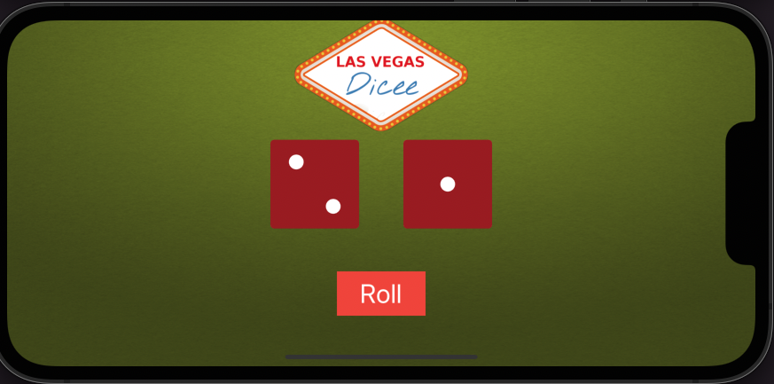

# Auto Layout 

If you run the app on screens with different aspect ratios or try to turn it to landscape, the designs will look broken. 

Auto Layout allows us to set rules as to how we want our views to be displayed. Because mobile screens have different resolutions and sizes, we need these rules to tell the iPhone/iPad how it should layout all the elements in the storyboard onto the display. These rules allow our UI elements to be resized and positioned so that no matter which screen they are displayed on, they always look as the designer intended.

Although Dice application is already pretty nice, we get into problems when we try to rotate the screen to landscape or if we have a screen size that is not the same as the canvas. In this project i have fixed this and make dice app look exactly the way i wanted.

## What i have learnt while building "Rolling Dice (AutoLayout Version)" application?

--> How to add constraints and understand how auto layout works.

--> How to Pin and Align UI elements.

--> How to create containers to configure advanced layouts.

--> How to debug auto layout errors.

--> I have learned the pre-requisites to automatic layout.

--> How to use stack views to easily layout your UI.

## Screenshots

 ---> iPhone 13
 
 
 

 ---> iPhone 13
 
 

----> iPhone 13 Pro Max

 

----> iPhone 13 Pro Max

----> iPad Mini(6th generation)

 

----> iPad Mini(6th generation)

 

